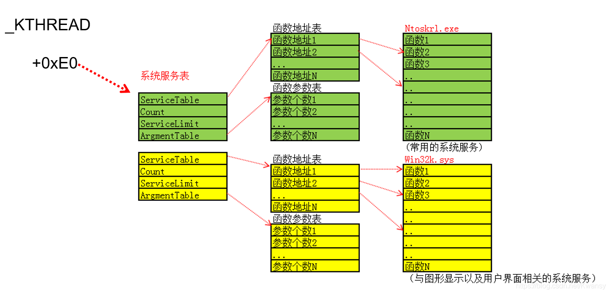

逆向分析了 KiSystemService 和 KiFastCallEntry 填充_KTRAP_FRAME 结构体的代码，二者大同小异，主要的区别是 sysenter 只改了eip,cs,ss，虽然esp也改了，但是windows不使用，而是从TSS里取esp0；另外sysenter并没有像中断门那样压栈，所以3环的 ss, esp, eflags, cs,eip都要在函数里依次保存到 _KTRAP_FRAME 。

KiSystemService / KiFastCallEntry 调用内核函数部分，放在一块讲是因为这两个函数虽然入口不同，但是填充完 _KTRAP_FRAME 后，就会执行相同的代码。他们两个函数就像两头蛇一样，有两个入口，初始化的工作有区别，但是往后就共用一个函数体。
 
思考两个问题：
如何根据系统服务号(eax中存储)找到要执行的内核函数？
调用时参数是存储到3环的堆栈，如何传递给内核函数？
 
SystemServiceTable 系统服务表
首先强调，SystemServiceTable 系统服务表不是SSDT。

ServiceTable 指向函数地址表
Count没有用
ArgmentTable 指向函数参数表
ServiceLimit 是这两张表的长度。
如图：

