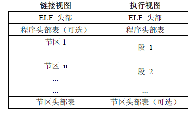

### 1. ELF文件简介
ELF文件主要有三种：可重定位的对象文件(Relocatable file，如：.o .ko文件)，可执行的对象文件(Executable file，如：.out文件)，可被共享的对象文件(Shared object file，如：.so文件)

### 2. ELF文件格式
- ELF header： 描述整个文件的组织。
- Program Header Table: 描述文件中的各种segments，用来告诉系统如何创建进程映像的。
- sections 或者 segments：segments是从运行的角度来描述elf文件，sections是从链接的角度来描述elf文件，也就是说，在链接阶段，我们可以忽略program header table来处理此文件，在运行阶段可以忽略section header table来处理此程序（所以很多加固手段删除了section header table）。从图中我们也可以看出，segments与sections是包含的关系，一个segment包含若干个section。
- Section Header Table: 包含了文件各个segction的属性信息，我们都将结合例子来解释。

组成：
ELF文件格式提供了两种视图，分别是链接视图和执行视图。链接视图是以节（section）为单位，执行视图是以段（segment）为单位。链接视图就是在链接时用到的视图，而执行视图则是在执行时用到的视图。

程序头部表（Program Header Table），如果存在的话，告诉系统如何创建进程映像。
节区头部表（Section Header Table）包含了描述文件节区的信息，比如大小、偏移等。

### 3. ELF Header
ELF Header的结构体：

#define EI_NIDENT 16
typedef struct {
    unsigned char e_ident[EI_NIDENT]; //ELF的一些标识信息，前四位为.ELF,其他的信息比如大小端等
    ELF32_Half e_type; //
    ELF32_Half e_machine; //文件的目标体系架构，比如ARM
    ELF32_Word e_version; //0为非法版本，1为当前版本
    ELF32__Addr e_entry; // * 程序入口的虚拟地址
    ELF32_Off e_phoff; // * 程序头部表偏移地址
    ELF32_Off e_shoff; // * 节区头部表偏移地址
    ELF32_Word e_flags; //保存与文件相关的，特定于处理器的标志
    ELF32_Half e_ehsize; // * ELF头的大小
    ELF32_Half e_phentsize; // * 每个程序头部表的大小
    ELF32_Half e_phnum; // * 程序头部表的数量
    ELF32_Half e_shentsize; // * 每个节区头部表的大小
    ELF32_Half e_shnum; // * 节区头部表的数量
    ELF32_Half e_shstrndx; // * 节区字符串表位置
}Elf32_Ehdr;

在ELF Header中我们需要重点关注以下几个字段：
1、e_entry表示程序入口地址
2、e_ehsize：ELF Header结构大小
3、e_phoff、e_phentsize、e_phnum：描述Program Header Table的偏移、大小、个数。
4、e_shoff、e_shentsize、e_shnum：描述Section Header Table的偏移、大小、个数。
5、 e_shstrndx：这一项描述的是字符串表在Section Header Table中的索引，值25表示的是Section Header Table中第25项是字符串表（String Table）。
6、编译后比较固定的字段：e_ident 、 e_machine 、e_version 、e_entry 、e_flags 、e_ehsize
7、目前e_ehsize = 52字节，e_shentsize = 40字节，e_phentsize = 32字节，这些值都是固定值，某些加固会修改这些值造成静态解析失败，可以修改回这些固定值
8、整个so的大小 = e_shoff + e_shnum * sizeof(e_shentsize) + 1
9、e_shstrndx一般等于e_shnum - 1
10、e_phoff = ELF头的大小

### 4. Section Header Table
一个ELF文件中到底有哪些具体的 sections，由包含在这个ELF文件中的 section head table(SHT)决定。在SHT中，针对每一个section，都设置有一个条目（entry），用来描述对应的这个section，其内容主要包括该 section 的名称、类型、大小以及在整个ELF文件中的字节偏移位置等等。
typedef struct{
    Elf32_Word sh_name;   //节区名，是节区头部字符串表节区（Section Header String Table Section）的索引。名字是一个 NULL 结尾的字符串。
    Elf32_Word sh_type;    //为节区类型
    Elf32_Word sh_flags;    //节区标志
    Elf32_Addr sh_addr;    //如果节区将出现在进程的内存映像中，此成员给出节区的第一个字节应处的位置。否则，此字段为 0。
    Elf32_Off sh_offset;    //此成员的取值给出节区的第一个字节与文件头之间的偏移。
    Elf32_Word sh_size;   //此成员给出节区的长度（字节数）。
    Elf32_Word sh_link;   //此成员给出节区头部表索引链接。其具体的解释依赖于节区类型。
    Elf32_Word sh_info;       //此成员给出附加信息，其解释依赖于节区类型。
    Elf32_Word sh_addralign;    //某些节区带有地址对齐约束.
    Elf32_Word sh_entsize;    //某些节区中包含固定大小的项目，如符号表。对于这类节区，此成员给出每个表项的长度字节数。
}Elf32_Shdr;
 
 

