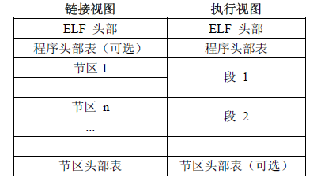

### 1. ELF文件简介
ELF文件主要有三种：可重定位的对象文件(Relocatable file，如：.o .ko文件)，可执行的对象文件(Executable file，如：.out文件)，可被共享的对象文件(Shared object file，如：.so文件)

### 2. ELF文件格式
- ELF header： 描述整个文件的组织。
- Program Header Table: 描述文件中的各种segments，用来告诉系统如何创建进程映像的。
- sections 或者 segments：segments是从运行的角度来描述elf文件，sections是从链接的角度来描述elf文件，也就是说，在链接阶段，我们可以忽略program header table来处理此文件，在运行阶段可以忽略section header table来处理此程序（所以很多加固手段删除了section header table）。从图中我们也可以看出，segments与sections是包含的关系，一个segment包含若干个section。
- Section Header Table: 包含了文件各个segction的属性信息，我们都将结合例子来解释。

组成：
ELF文件格式提供了两种视图，分别是链接视图和执行视图。链接视图是以节（section）为单位，执行视图是以段（segment）为单位。链接视图就是在链接时用到的视图，而执行视图则是在执行时用到的视图。

程序头部表（Program Header Table），如果存在的话，告诉系统如何创建进程映像。
节区头部表（Section Header Table）包含了描述文件节区的信息，比如大小、偏移等。

### 3. ELF Header
ELF Header的结构体：

#define EI_NIDENT 16
typedef struct {
    unsigned char e_ident[EI_NIDENT]; //ELF的一些标识信息，前四位为.ELF,其他的信息比如大小端等
    ELF32_Half e_type;                //类型，详细查看elf.h
    ELF32_Half e_machine;             //文件的目标体系架构，比如ARM
    ELF32_Word e_version;             //0为非法版本，1为当前版本
    ELF32__Addr e_entry;              // * 程序入口的虚拟地址
    ELF32_Off e_phoff;                // * 程序头部表偏移地址
    ELF32_Off e_shoff;                // * 节区头部表偏移地址
    ELF32_Word e_flags;               //保存与文件相关的，特定于处理器的标志
    ELF32_Half e_ehsize;              // * ELF头的大小
    ELF32_Half e_phentsize;           // * 每个程序头部表的大小
    ELF32_Half e_phnum;               // * 程序头部表的数量
    ELF32_Half e_shentsize;           // * 每个节区头部表的大小
    ELF32_Half e_shnum;               // * 节区头部表的数量
    ELF32_Half e_shstrndx;            // * 节区字符串表位置
}Elf32_Ehdr;

在ELF Header中我们需要重点关注以下几个字段：
1. e_entry表示程序入口地址
2. e_ehsize：ELF Header结构大小
3. e_phoff、e_phentsize、e_phnum：描述Program Header Table的偏移、大小、个数。
4. e_shoff、e_shentsize、e_shnum：描述Section Header Table的偏移、大小、个数。
5. e_shstrndx：这一项描述的是字符串表在Section Header Table中的索引，值25表示的是Section Header Table中第25项是字符串表（String Table）。
6. 编译后比较固定的字段：e_ident 、 e_machine 、e_version 、e_entry 、e_flags 、e_ehsize
7. 目前e_ehsize = 52字节，e_shentsize = 40字节，e_phentsize = 32字节，这些值都是固定值，某些加固会修改这些值造成静态解析失败，可以修改回这些固定值
8. 整个so的大小 = e_shoff + e_shnum * sizeof(e_shentsize) + 1
9. e_shstrndx一般等于e_shnum - 1
10. e_phoff = ELF头的大小

### 4. Section Header Table
一个ELF文件中到底有哪些具体的 sections，由包含在这个ELF文件中的 section head table(SHT)决定。在SHT中，针对每一个section，都设置有一个条目（entry），用来描述对应的这个section，其内容主要包括该 section 的名称、类型、大小以及在整个ELF文件中的字节偏移位置等等。
typedef struct{
    Elf32_Word sh_name;       //节区名，是节区头部字符串表节区（Section Header String Table Section）的索引。名字是一个 NULL 结尾的字符串。
    Elf32_Word sh_type;       //为节区类型
    Elf32_Word sh_flags;      //节区标志
    Elf32_Addr sh_addr;       //如果节区将出现在进程的内存映像中，此成员给出节区的第一个字节应处的位置。否则，此字段为 0。
    Elf32_Off sh_offset;      //此成员的取值给出节区的第一个字节与文件头之间的偏移。
    Elf32_Word sh_size;       //此成员给出节区的长度（字节数）。
    Elf32_Word sh_link;       //此成员给出节区头部表索引链接。其具体的解释依赖于节区类型。
    Elf32_Word sh_info;       //此成员给出附加信息，其解释依赖于节区类型。
    Elf32_Word sh_addralign;  //某些节区带有地址对齐约束.
    Elf32_Word sh_entsize;    //某些节区中包含固定大小的项目，如符号表。对于这类节区，此成员给出每个表项的长度字节数。
}Elf32_Shdr;

#### 5. Sections
有些节区是系统预订的，一般以点开头号，常用到的系统节区有：
名称                     类型                   含义   
.bss                     SHT_NOBITS             包含将出现在程序的内存映像中的为初始化数据。根据定义，当程序开始执行，系统将把这些数据初始化为 0。此节区不占用文件空间
.text	                 SHT_PROGBITS           此节区包含程序的可执行指令。
.data                    SHT_PROGBITS           这些节区包含初始化了的数据，将出现在程序的内存映像中。
.data1                   SHT_PROGBITS           这些节区包含初始化了的数据，将出现在程序的内存映像中。
.comment                 SHT_PROGBITS           包含版本控制信息。
.debug	                 SHT_PROGBITS           此节区包含用于符号调试的信息
.dynamic	             SHT_DYNAMIC            此节区包含动态链接信息。节区的属性将包含 SHF_ALLOC 位。是否 SHF_WRITE 位被设置取决于处理器
.dynstr	                 SHT_STRTAB             字符串表，此节区包含用于动态链接的字符串，大多数情况下这些字符串代表了与符号表项相关的名称。
.dynsym	                 SHT_DYNSYM             符号表，此节区包含了动态链接符号表。
.fini	                 SHT_PROGBITS           此节区包含了可执行的指令，是进程终止代码的一部分。程序正常退出时，系统将安排执行这里的代码。
.got	                 SHT_PROGBITS           此节区包含全局偏移表。
.hash	                 SHT_HASH               此节区包含了一个符号哈希表。
.init	                 SHT_PROGBITS           此节区包含了可执行指令，是进程初始化代码的一部分。当程序开始执行时，系统要在开始调用主程序入口之前（通常指 C 语言的 main 函数）执行这些代码。
.interp	                 SHT_PROGBITS           此节区包含程序解释器的路径名。如果程序包含一个可加载的段，段中包含此节区，那么节区的属性将包含 SHF_ALLOC 位，否则该位为 0。
.line	                 SHT_PROGBITS           此节区包含符号调试的行号信息，其中描述了源程序与机器指令之间的对应关系。其内容是未定义的。
.note	                 SHT_NOTE               此节区中包含注释信息，有独立的格式。
.plt	                 SHT_PROGBITS           此节区包含过程链接表（procedure linkage table）。
.relname和.relaname      SHT_REL和SHT_RELA     （.relname和.relaname）这些节区中包含了重定位信息。如果文件中包含可加载的段，段中有重定位内容，节区的属性将包含 SHF_ALLOC 位，否则该位置 0。传统上 name 根据重定位所适用的节区给定。例如 .text 节区的重定位节区名字将是：.rel.text 或者 .rela.text。		                                                   
.rodata和.rodata1        SHT_PROGBITS           这些节区包含只读数据，这些数据通常参与进程映像的不可写段。
.shstrtab	             SHT_STRTAB             此节区包含节区名称。
.strtab	                 SHT_STRTAB             此节区包含字符串，通常是代表与符号表项相关的名称。如果文件拥有一个可加载的段，段中包含符号串表，节区的属性将包含SHF_ALLOC 位，否则该位为 0。   
.symtab	                 SHT_SYMTAB             此节区包含一个符号表。如果文件中包含一个可加载的段，并且该段中包含符号表，那么节区的属性中包含SHF_ALLOC 位，否则该位置为 0。

重点讲解以下section
5.1 符号表
符号表包含用来定位、重定位程序中符号定义和引用的信息，简单的理解就是符号表记录了该文件中的所有符号，所谓的符号就是经过修饰了的函数名或者变量名，不同的编译器有不同的修饰规则。例如符号_ZL15global_static_a，就是由global_static_a变量名经过修饰而来。
typedef struct
{
  Elf64_Word	st_name;		/* Symbol name (string tbl index) */
  unsigned char	st_info;		/* Symbol type and binding */
  unsigned char st_other;		/* Symbol visibility */
  Elf64_Section	st_shndx;		/* Section index */
  Elf64_Addr	st_value;		/* Symbol value */
  Elf64_Xword	st_size;		/* Symbol size */
} Elf64_Sym;

5.2 动态链接符号表
typedef struct
{
  Elf64_Sxword	d_tag;			/* Dynamic entry type */
  union
    {
      Elf64_Xword d_val;		/* Integer value */
      Elf64_Addr d_ptr;			/* Address value */
    } d_un;
} Elf64_Dyn;

5.3 重定位表
typedef struct
{
  Elf32_Addr	r_offset;		/* Address */
  Elf32_Word	r_info;			/* Relocation type and symbol index */
  Elf32_Sword	r_addend;		/* Addend */
} Elf32_Rela;

typedef struct
{
  Elf64_Addr	r_offset;		/* Address */
  Elf64_Xword	r_info;			/* Relocation type and symbol index */
  Elf64_Sxword	r_addend;		/* Addend */
} Elf64_Rela;

### 6. Program Header Table
程序头部（Program Header）描述与程序执行直接相关的目标文件结构信息。用来在文件中定位各个段的映像。同时包含其他一些用来为程序创建映像所必须的信息。可执行文件、so文件有程序头，目标文件(.o)没有程序头。
typedef struct {  
    Elf32_Word p_type;      //此数组元素描述的段的类型，或者如何解释此数组元素的信息。 
    Elf32_Off  p_offset;    //此成员给出从文件头到该段第一个字节的偏移
    Elf32_Addr p_vaddr;     //此成员给出段的第一个字节将被放到内存中的虚拟地址
    Elf32_Addr p_paddr;     //此成员仅用于与物理地址相关的系统中。System V忽略所有应用程序的物理地址信息。
    Elf32_Word p_filesz;    //此成员给出段在文件映像中所占的字节数。可以为0。
    Elf32_Word p_memsz;     //此成员给出段在内存映像中占用的字节数。可以为0。
    Elf32_Word p_flags;     //此成员给出与段相关的标志。
    Elf32_Word p_align;     //此成员给出段在文件中和内存中如何对齐。
} Elf32_phdr;

引用： https://blog.csdn.net/mergerly/article/details/94585901

